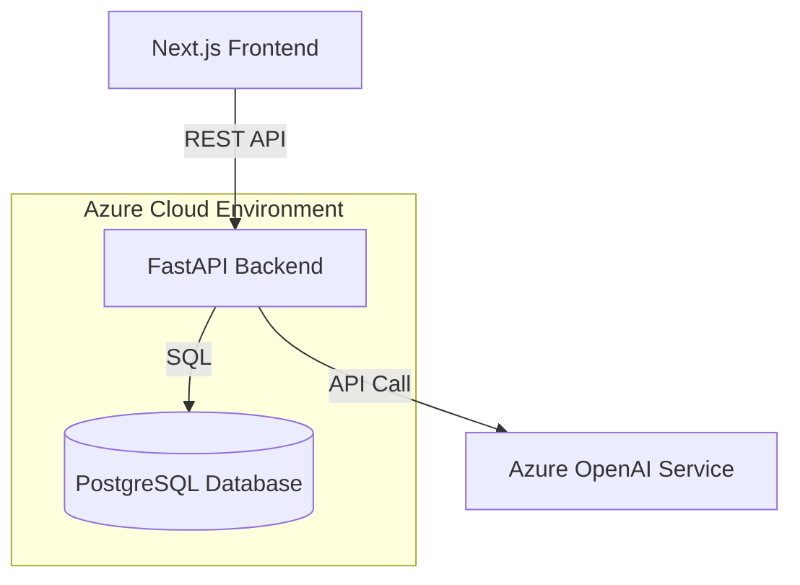

# Project Design: NexusCRM - Intelligent Customer Intelligence Platform

## 1. Project Name & Concept

**Project Name:** **NexusCRM**
**Tagline:** *Where relationships meet intelligence.*

**Concept:**
NexusCRM is a B2B Customer Relationship Management (CRM) system designed to help small businesses manage their sales pipeline. Unlike a standard spreadsheet, NexusCRM tracks the *lifecycle* of a business relationship—from a cold lead to a closed deal.

**The "Twist":** It integrates **AI** to act as a "Sales Assistant." Instead of just reading rows of data, the user can ask the system questions like, *"What was the last email I sent to Acme Corp?"* or *"Draft a follow-up email for this lead emphasizing our new feature."*

**Who would use it in real life?**
Sales representatives, account managers, and business owners who need to track interactions and revenue opportunities without getting bogged down in administrative data entry.

---

## 2. Skills You Will Learn

This project is carefully scoped to hit every major keyword in a Senior Engineer's skillset:

### Frontend (Next.js & React)
*   **State Management:** Handling complex form state and "Kanban" board drag-and-drop.
*   **Data Fetching:** Using React Query (TanStack Query) for caching and optimistic updates.
*   **UI/UX:** Building responsive dashboards with Tailwind CSS and charting libraries (Recharts).
*   **Next.js Features:** Server Components vs. Client Components, API Routes (BFF pattern).

### Backend (Python & FastAPI)
*   **API Design:** RESTful standards, dependency injection, and Pydantic models for strict data validation.
*   **Async Programming:** Using Python's `async/await` for high-performance database queries.
*   **Architecture:** Layered architecture (Routers -> Controllers -> Services -> Repositories).
*   **Testing:** Writing unit and integration tests with `pytest`.

### Database (PostgreSQL)
*   **Schema Design:** One-to-Many (Leads -> Deals) and Many-to-Many relationships.
*   **Indexing & Performance:** Optimizing queries for search and analytics.
*   **Migrations:** Using generic tools (like Alembic) to manage schema changes over time.

### DevOps & Cloud (Azure)
*   **Containerization:** Dockerizing the Frontend and Backend services.
*   **Infrastructure as Code:** Using Terraform to provision Azure App Services and Azure SQL.
*   **CI/CD:** GitHub Actions to build and deploy automatically.

### AI & Intelligence (RAG & OpenAI)
*   **RAG (Retrieval-Augmented Generation):** How to turn database rows (interaction history) into "context" for the AI.
*   **Prompt Engineering:** Designing system prompts that make the AI behave like a Sales Assistant.
*   **Embeddings:** (Optional) Vector search for finding "similar leads."

---

## 3. System Architecture

We will follow a **Modern Monolithic** approach initially, evolving into a Cloud-Native architecture.

### High-Level Diagram

### Components
1.  **Frontend (Next.js):** The user interface. It talks *only* to the FastAPI backend.
2.  **Backend API (FastAPI):** The brain. It handles business logic, auth, and data validation.
3.  **Database (PostgreSQL):** The source of truth. Stores structured data (Contacts, Deals).
4.  **AI Service (Module within FastAPI):** A specialized service layer that constructs prompts and calls the OpenAI API.

**Why this architecture?**
*   **Decoupled:** The frontend and backend are separate. You could swap the frontend for a mobile app later without changing the backend.
*   **Scalable:** FastAPI is incredibly fast (ASGI) and fits well in serverless or containerized environments.

---

## 4. Feature Roadmap (Phases)

We will build this in layers to avoid overwhelming you.

### Phase 1: The Core MVP (The "Excel Killer")
*   **Goal:** A working database where you can Add, Edit, and View Leads and Deals.
*   **Features:**
    *   Setup FastAPI with a simple SQLite database (easier for local start).
    *   Create `Lead` and `Contact` CRUD endpoints.
    *   Next.js Dashboard displaying a list of Leads.
    *   Simple "Lead Detail" page showing basic info.
*   **Learning:** Basic FastAPI structure, Pydantic, React Hooks, Tailwind layouts.

### Phase 2: Professional Features (The "SaaS Ready")
*   **Goal:** Make it robust and realistic.
*   **Features:**
    *   **Switch to PostgreSQL.**
    *   **Kanban Board:** A Drag-and-drop UI for moving Deals between stages (New -> Negotiation -> Closed).
    *   **Dashboard:** Charts showing "Total Pipeline Value" and "Leads by Source."
    *   **Interaction Logging:** A timeline view to add notes ("Called customer, they are interested").
*   **Learning:** Complex SQL queries, React DnD (Drag and Drop), Recharts, State Management.

### Phase 3: The AI & Cloud Layer (The "Portfolio Piece")
*   **Goal:** Deploy to Azure and add Intelligence.
*   **Features:**
    *   **AI Chat:** A floating chat widget. User asks: *"Summarize the last 3 notes for this lead."* -> Backend fetches notes -> Sends to LLM -> Returns summary.
    *   **Containerization:** Create `Dockerfile` for FE and BE.
    *   **Azure Deployment:** Use Terraform to spin up an Azure Web App for Containers and an Azure Database for PostgreSQL.
*   **Learning:** Docker, Terraform, Azure, RAG patterns, OpenAI API.

---

## 5. Database Design

We need a relational schema that allows for meaningful queries.

### Tables

1.  **leads**
    *   `id` (PK), `company_name`, `status` (New, Qualified, Lost), `source` (LinkedIn, Website), `created_at`
    *   *Purpose:* The main entity. A potential customer.

2.  **contacts**
    *   `id` (PK), `lead_id` (FK), `name`, `email`, `phone`, `role`
    *   *Purpose:* The actual humans we talk to at the company.

3.  **deals**
    *   `id` (PK), `lead_id` (FK), `amount` (Float), `stage` (Prospecting, Negotiation, Closed Won), `expected_close_date`
    *   *Purpose:* Represents money. Used for the Kanban board and Dashboard analytics.

4.  **interactions**
    *   `id` (PK), `lead_id` (FK), `type` (Call, Email, Meeting), `notes` (Text), `date`
    *   *Purpose:* The history of communication. **Crucial for the AI context.**

### Relationships
*   A `Lead` has many `Contacts`.
*   A `Lead` has many `Deals` (usually one active, but can have upsells).
*   A `Lead` has many `Interactions`.

**Why this design?**
It separates the *Company* (Lead) from the *Opportunity* (Deal). This is how real CRMs (Salesforce/HubSpot) work. It allows you to analyze "How much money is in the Negotiation stage?" separately from "How many new leads did we get?"

---

## 6. API Design

We will use RESTful conventions.

### Key Endpoints

**Leads**
*   `GET /leads`: List all leads (with filtering/pagination).
*   `POST /leads`: Create a new lead.
*   `GET /leads/{id}`: Get full details, including contacts and deals.

**Deals**
*   `GET /deals/pipeline`: Get deals grouped by Stage (for the Kanban board).
*   `PATCH /deals/{id}/stage`: Update just the stage (when dragging a card).

**AI**
*   `POST /ai/chat`:
    *   **Request:** `{ "message": "Draft a follow-up email", "context_lead_id": 12 }`
    *   **Logic:** Backend fetches `Lead` info + last 5 `Interactions` -> Constructs Prompt -> Calls OpenAI -> Returns text.
    *   **Response:** `{ "response": "Subject: Following up...\n\nHi John,..." }`

---

## 7. Frontend Pages

1.  **Dashboard (`/`)**
    *   **Teaches:** Data visualization (Charts), KPI cards ("Total Revenue").
2.  **Pipeline Board (`/pipeline`)**
    *   **Teaches:** Complex UI state, Drag-and-drop libraries, optimistic UI updates.
3.  **Lead List (`/leads`)**
    *   **Teaches:** Data tables, pagination, server-side filtering.
4.  **Lead Detail View (`/leads/[id]`)**
    *   **Teaches:** Master-Detail views, tabbed interfaces (Timeline vs Contacts), Forms.
5.  **AI Assistant (Global Widget)**
    *   **Teaches:** Websockets or Polling, chat UI implementation.

---

## 8. Stretch Goals (For "Senior" status)

1.  **Auth & Multi-Tenancy:** Add a `tenant_id` to every table so multiple companies can use the SaaS securely.
2.  **Email Ingestion:** Use SendGrid/Azure Logic Apps to forward emails directly into the `interactions` table.
3.  **Terraform Modules:** Organize your infrastructure code into reusable modules.

---

## 9. How This Helps Your Career

**The Interview Pitch:**
> "I built NexusCRM to bridge the gap between basic CRUD apps and real-world SaaS platforms. I chose a **FastAPI/Next.js** stack to focus on performance and type safety.
>
> I architected the database to handle complex relationships between Leads and Deals, mimicking enterprise systems like HubSpot.
>
> The most challenging part was the **AI integration**; I implemented a RAG pattern where the chatbot pulls context from the specific Lead's interaction history to generate relevant responses, rather than just being a generic wrapper.
>
> Finally, I deployed it to **Azure** using **Terraform** to ensure the infrastructure was reproducible and production-ready."

**What this proves:**
1.  You understand **Business Logic** (CRM workflows), not just code syntax.
2.  You can build **Full-Stack Features** end-to-end.
3.  You have practical experience with **GenAI** beyond just calling an API.
4.  You know **Cloud/DevOps** (Azure/Terraform), which is rare for juniors.
